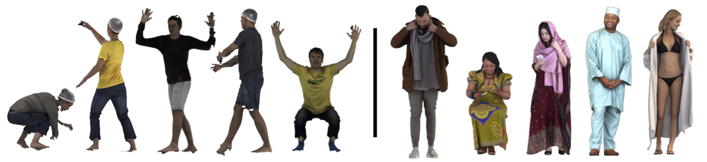

## Test Data



- OOD pose (CAPE, [download](https://github.com/YuliangXiu/ICON/blob/master/docs/evaluation.md#cape-testset)): [`pose.txt`](../pose.txt)
- OOD outfits (RenderPeople, [link](https://renderpeople.com/)): [`loose.txt`](../loose.txt)


## Citation

:+1: Please cite these CAPE-related papers

```
@inproceedings{CAPE:CVPR:20,
  title = {{Learning to Dress 3D People in Generative Clothing}},
  author = {Ma, Qianli and Yang, Jinlong and Ranjan, Anurag and Pujades, Sergi and Pons-Moll, Gerard and Tang, Siyu and Black, Michael J.},
  booktitle = {Computer Vision and Pattern Recognition (CVPR)},
  month = June,
  year = {2020},
  month_numeric = {6}
}

@article{Pons-Moll:Siggraph2017,
  title = {ClothCap: Seamless 4D Clothing Capture and Retargeting},
  author = {Pons-Moll, Gerard and Pujades, Sergi and Hu, Sonny and Black, Michael},
  journal = {ACM Transactions on Graphics, (Proc. SIGGRAPH)},
  volume = {36},
  number = {4},
  year = {2017},
  note = {Two first authors contributed equally},
  crossref = {},
  url = {http://dx.doi.org/10.1145/3072959.3073711}
}
```